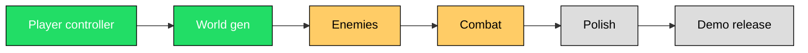

# 🎮 Dev Update — Week of YYYY-MM-DD

> **Project:** *Working Title*  
> **Build:** `v0.3.1-alpha`  
> **Playable:** [itch.io link](https://itch.io) · [Web build](https://example.com)

---

## 🎯 This week's focus

A one-line summary of what the week was about.

- ✅ **Shipped:** what actually got done
- 🚧 **In progress:** what's still cooking
- 🧪 **Testing:** what needs eyes on it
- 🛑 **Blocked:** anything stuck, and why

> [!IMPORTANT]
> Playtesters wanted! Download the latest build and drop feedback in the [Discussions tab](../../discussions).

---

## 🧱 What changed

### ✨ Features

| Feature | Status | Notes |
|---|---|---|
| Player controller | ✅ Done | First-person, WASD + mouse look |
| Grass texture | 🚧 WIP | Procedural noise, needs tuning |
| Day/night cycle | 🧪 Test | Needs shader pass |
| Save system | 🛑 Blocked | Waiting on level format decision |

### 🐛 Fixes

- Fixed player falling through floor tiles (added `StaticBody3D` colliders)
- Fixed camera pitch flipping past ±89°
- Corrected grass spawning outside tile bounds

### 🧹 Chores

- Split `main.gd` into `world.gd` + `tiles.gd`
- Updated to Godot 4.3
- Removed unused placeholder assets

---

## 📸 Media

### Screenshot

### GIF / short clip

📼 Older clips (click to expand)

- [Week 10 walkthrough](media/clip-week10.mp4)
- [Week 8 first playable](media/clip-week08.mp4)

---

## 🧠 Design notes

A short paragraph on a decision made this week and *why*.

> **Decision:** Switched the floor from individual `MeshInstance3D` tiles to a `GridMap`.  
> **Why:** Reduced node count from 25 to 1 and made collision trivial.  
> **Trade-off:** Lost per-tile material overrides — acceptable for now.

---

## 🗺️ Roadmap

---

## ✅ Next week's tasks

- [x] Finish grass shader
- [ ] Wire up footstep audio
- [ ] Add pause menu
- [ ] Profile and cap draw calls at 500
- [ ] Write a short devlog post

---

## 🐞 Known issues

> [!WARNING]
> These are actively being worked on. Don't report duplicates.

| Issue | Severity | Workaround |
|---|---|---|
| Player can clip through walls at high speed | High | None |
| Grass z-fights at tile seams | Low | None |
| Jump feels floaty | Medium | Tune `jump_velocity` in inspector |

> [!CAUTION]
> The save system is **not** compatible between builds this week. Back up your saves.

---

## 🙏 Thanks

Shout-outs to playtesters, contributors, or anyone who helped this week.

- @username — bug reports
- @username — shader help
- Everyone in the [Discord](https://discord.gg/example)

---

## 🔗 Links

- [Repo](https://github.com/user/repo)
- [Issue tracker](../../issues)
- [Previous update](../week-11/README.md)
- [Devlog blog](https://example.com/blog)

---

*Made with Godot 4 · MIT licensed · Feedback welcome* :heart:
